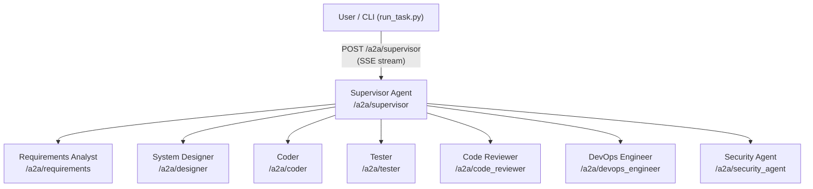
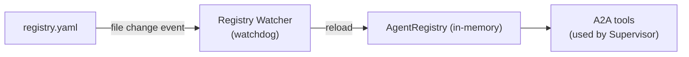

# Architecture

## System Overview

The system is built around a **Supervisor** agent that decomposes tasks and delegates work to specialist agents over the A2A (Agent-to-Agent) protocol.



---

## Communication Protocol

All agents communicate over the **A2A protocol** — a JSON-RPC 2.0 + Server-Sent Events (SSE) standard for inter-agent messaging.

- **Request method:** `message/stream`
- **Transport:** HTTP POST with `text/event-stream` response
- **Streaming:** Each agent emits incremental status updates and artifact events as it works

### Example A2A Request

```json
{
  "jsonrpc": "2.0",
  "id": "<uuid>",
  "method": "message/stream",
  "params": {
    "message": {
      "role": "user",
      "parts": [{ "kind": "text", "text": "Create a clock app" }],
      "messageId": "<uuid>"
    }
  }
}
```

---

## Agent Registry

Agent metadata (name, description, endpoint, skills, status) is stored in [`registry.yaml`](https://github.com/AlokRanjanSwain/multi_agents/blob/main/registry.yaml) and loaded at startup.

A **file watcher** (`watchdog`) monitors `registry.yaml` at runtime and hot-reloads changes automatically — no server restart needed when adding or modifying agent metadata.



---

## Project Structure

```
.
├── src/
│   ├── agents/          # Agent implementations
│   │   ├── supervisor.py
│   │   ├── requirements_analyst.py
│   │   ├── system_designer.py
│   │   ├── coder.py
│   │   ├── tester.py
│   │   ├── code_reviewer.py
│   │   ├── base.py      # Shared A2A route factory
│   │   └── _template.py # Template for new agents
│   ├── common/
│   │   ├── tools.py     # Shared ADK tools (send_task_to_agent, etc.)
│   │   ├── prompts.py   # Shared prompt helpers
│   │   └── artifact_store.py
│   ├── registry/
│   │   ├── registry.py  # AgentRegistry class
│   │   ├── watcher.py   # File-watcher for hot-reload
│   │   └── models.py    # Pydantic models
│   ├── config.py        # Pydantic settings (loads .env)
│   ├── tracing.py       # Langfuse + ADK instrumentation
│   └── main.py          # FastAPI app & lifespan startup
├── ui/
│   └── registry_app.py  # Streamlit agent registry browser
├── registry.yaml        # Agent metadata
├── run_task.py          # CLI task runner with SSE streaming
├── docker-compose.yml
├── docker-compose.langfuse.yml
├── Dockerfile
└── pyproject.toml
```

---

## Observability

Tracing is provided by **Langfuse** with `openinference-instrumentation-google-adk` for automatic span capture.

Every agent invocation, LLM call, and tool use is traced and available in the Langfuse dashboard at `http://localhost:3001`.
